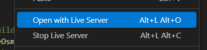
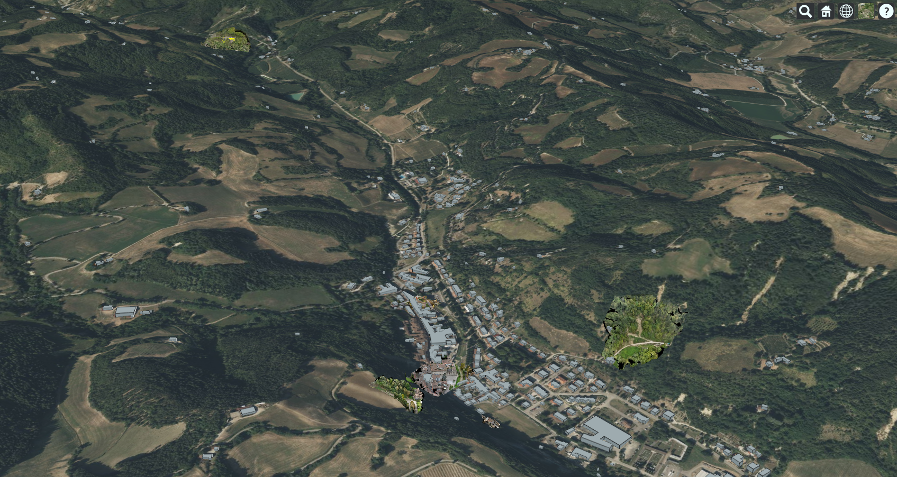
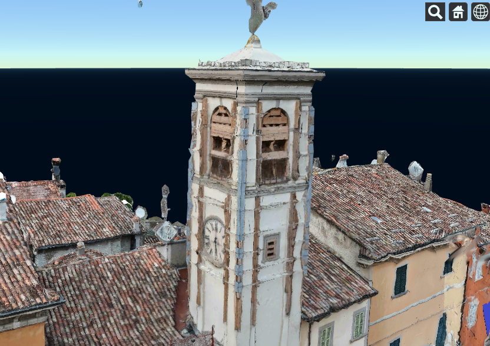

# Cesium Test & Demo Repository

Questo repository contiene una serie di preliminary test e demo utilizzando Cesium, una piattaforma open-source per la visualizzazione di dati 3D geospaziali. Il progetto include esempi pratici per l'importazione di diversi tipi di dati geospaziali, tra cui:

* Modelli 3D
* Bing/Google/Cesium World Terrain
* Sistemi OSM (OpenStreetMap)
* Strutture KML e GeoJSON

Gran parte degli esperimenti sono presenti nella cartella [text](test) con la seguente struttura: 

```
test/
├── cesiumTile/     # 3D Tile models
│   └── tileset_folders/
├── css/         
├── data/           # free geospatial data formats
├── glbData/        # free samples models
├── js/
│   ├── cesimConfig.js      # cesiumAccessToken and tileset urls
│   ├── cesiumFun.js        # export function to load tileset  
│   ├── index.js            # main 3D tileset upload
│   └── debugBoundingBox.js # set bounding box tile glb and wireframe model
└── index.html      # main html
```

Inoltre, il repository fornisce una GUI che permette di applicare o rimuovere effetti visivi sui modelli e sulle strutture, come la visualizzazione di texture, illuminazione e altro.

## Note d'uso
Per facilitare l'utilizzo di un server locale è possibile utilizare una Extension di Visual Studio: Live Server (ritwickdey.LiveServer) il quale riesce a simulare un server sul file index.html delle singole demo. Una volta importata l'estensione, tasto destro sul file html per avviare e stoppare il server locale.

<center></center>

Si verrà reindirizzati su un http://localhost:8080/

---

Un altro metodo è scaricare e installare Node.js e npm da https://nodejs.org/en/download/

Nella riga di comando, eseguire:
```
npm install http-server -g
```
Questo installerà l'app http-server da https://github.com/http-party/http-server su visibilità globale.

Nella directory che contiene i dati di esempio (test), eseguire:
```
http-server -a localhost -p 8003 --cors=http://localhost:8080/
```
Questo avvierà il server all'indirizzo `localhost`, utilizzando la porta `8003`. Il parametro `cors` permetterà a Cesium di accedere ai dati da questo server eseguito localmente.

In questa casistica è richiesto che un tileset debba essere referato impostando l'URL caricato dal server locale:

```
const tileset = viewer.scene.primitives.add(new Cesium.Cesium3DTileset({
    url : 'http://localhost:8003/example/tileset.json'
}));
```
---
## Few results

<center></center>

E' possibile vedere un set di modelli tiled importati correttamente e visualizzati sopra una mappa geospaziale di Cesium, insieme a modelli forniti da OpenStreetMap. 

A seguito della naturale conformità delle frane è stato necessario in corrispondenza di questi modelli eseguire un'operazione di sottrazione sulla superficie del terreno, che ha rimosso la parte di suolo che sovrastava la frana. Senza questo le frane sarebbero state visibili solo in parte, poiché coperti dal terreno circostante.

Diverse prove sono state effettuate dimostrando come la qualità dei modelli tiled è alta, con una visualizzazione chiara dei dettagli architettonici grazie alla loro intrinseca struttura di suddivisione in piccoli tiles che rappresentano sezioni geografiche del modello. Ogni tile può avere diversi livelli di dettaglio (LOD) che vengono selezionati dinamicamente in base alla distanza dalla camera. 

Questa differenza si nota dai modelli in formato obj i quali, oltre alla necessità di essere convertiti in CesiumION e non direttamente importabili su CesiumJS, riportano solamente un unico livello di dettaglio.

<center></center>