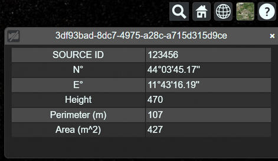

# Cesium Test & Demo Repository

This repository contains a series of tests and demos using Cesium, an open-source platform for visualizing 3D geospatial data. The project includes practical examples of importing different types of geospatial data, such as:

* 3D models
* Bing/Google/Cesium World Terrain
* OpenStreetMap (OSM) data
* KML and GeoJSON structures

## Project Structure
The [text](test) folder contains most of the experiments and is organized as follows:

```
test/
├── cesiumTile/     # 3D Tile models
│   └── tileset_folders/
├── css/         
├── data/           # Open geospatial data
├── glbData/        # Sample 3D models
├── js/
│   ├── cesimConfig.js      # cesiumAccessToken and tileset urls
│   ├── cesiumFun.js        # functions for loading tilesets  
│   ├── index.js            # main
│   └── debugBoundingBox.js # visualizes bounding boxes and wireframes
└── index.html      
```

The repository also includes a preliminary GUI that lets users apply or remove visual effects.

## Running a Local Server
To run the project locally, you can use the Live Server extension for Visual Studio Code (ritwickdey.LiveServer), which simulates a local webserver for the `index.html` file of each demo. After installing the extension, simply right-click the HTML file and select Start Live Server to launch it in your browser.

<center></center>

This will open a browser window with a URL like http://127.0.0.1:1234/index.html.

---

Another option is to install Node.js and npm from the [official Node.js website](https://nodejs.org/en/download/).

Then, in the terminal or command prompt, run:
```bash
npm install http-server -g
```
This globally installs [http-server](https://github.com/http-party/http-server), a simple static file server.

Next, navigate to the `test` directory and start the webserver with:
```bash
http-server -a localhost -p 8003 --cors=http://localhost:8080/
```
This starts a local webserver on `localhost`, using port `8003`. The `--cors` option allows Cesium to access the locally hosted data.

To load a tileset from the local webserver, use the following code:
```javascript
const tileset = viewer.scene.primitives.add(new Cesium.Cesium3DTileset({
    url : 'http://localhost:8003/example/tileset.json'
}));
```

## Main results

<center></center>

The image above shows a 3D tileset successfully imported and displayed over a Cesium geospatial map, alongside OpenStreetMap buildings.

Since landslides alter the natural shape of the terrain, we applied terrain subtraction to remove sections of the ground that originally covered the landslide area. Without this adjustment, the models would have been partially obscured by the surrounding landscape.

<center></center>

Our tests confirm that 3D tilesets provide high-quality rendering. Thanks to their Level of Detail (LOD) system, models dynamically adjust based on the camera's distance, ensuring optimal performance and visual clarity.

<center></center>

The image above highlights the bounding boxes of individual tiles that make up the building. Wireframe mode helps visualize how details progressively increase as the camera moves closer, demonstrating the efficiency of the tileset system.

Unlike Cesium Tilesets, OBJ models need to be converted using Cesium ION before they can be imported into CesiumJS. Additionally, OBJ models lack LOD support, meaning they always display the same level of detail, regardless of the camera's distance.

<center></center>

The repository also integrates KML and GeoJSON structures, making them clickable and interactive. Users can retrieve information about specific areas of interest directly within the visualization.

<center></center>
<center></center>

These experiments were conducted using survey data collected for the Innovation Grant HaMMon in the municipality of Tredozio.

## License

The scripts in this repository are distributed under the terms of the MIT License. See the [LICENSE](LICENSE) file for details.

## Acknowledgements

This work is supported by Italian Research Center on High Performance Computing Big Data and Quantum Computing (ICSC), project funded by European Union - NextGenerationEU - and National Recovery and Resilience Plan (NRRP) - Mission 4 Component 2 within the activities of Spoke 3 (Astrophysics and Cosmos Observations).